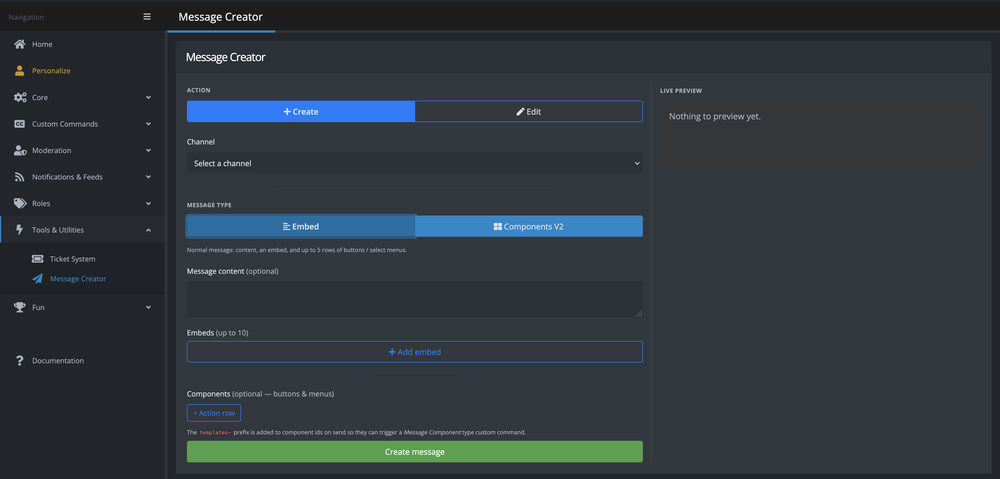

+++
title = "Message Creator"
weight = 720
description = "Build, send, and edit messages as the bot from the control panel."
+++

The Message Creator is a control panel tool for composing rich messages — content, embeds, and interactive components — and sending them to a channel **as the bot**, with a live Discord-style preview.
It can also edit messages the bot has already sent, which is handy for keeping a pinned announcement, rules post, or role menu up to date without rebuilding it from scratch.

You can find it under **Tools → Message Creator** in the control panel sidebar.

## Actions

At the top of the editor, the **Action** toggle chooses what you are doing:

- **Create**: compose a new message and send it to a channel. Select the target **Channel** from the dropdown.
- **Edit**: update a message the bot already sent. Paste the **Message link** of a message YAGPDB sent in this server and click **Load** to import its current content into the editor, then make your changes.



You can only edit messages that **YAGPDB itself sent**. The message link must point to a message in the current server, and Discord does not allow bots to edit messages authored by anyone else.

To copy a message link in Discord, right-click (or long-press) the message and choose **Copy Message Link**.



## Message type

The **Message type** toggle selects how the message is structured:

- **Embed**: a classic message that may combine message **content** (up to 2000 characters), up to **10 embeds**, and up to **5 action rows** of components.
- **Components V2**: a [Components V2](/docs/reference/components-v2) message built entirely out of components (up to **40 components** in total). Components V2 messages cannot use plain content or embeds, and must contain at least one component.

Each message type has its own builder, and the **Live preview** pane on the right shows an approximation of how the message will look in Discord as you edit.

## Components

Both message types support adding interactive components such as buttons and select menus.

When the message is sent, YAGPDB adds the `templates-` prefix to each component's custom ID (unless you set one yourself).
This lets the component trigger a [**Component** type custom command](/docs/custom-commands/commands#component), so you can wire up buttons and menus to run your own code.



## Limits and validation

The editor validates your message before sending and will report a clear error if something is invalid. Limits mirror Discord's own constraints, including:

- Message content: 2000 characters.
- Up to 10 embeds, each subject to Discord's per-field limits (title 256, description 4096, 25 fields, 6000 characters total, and so on).
- Embed, button, thumbnail, and media URLs must start with `http://`, `https://`, or `attachment://`.
- Up to 5 action rows; a select menu must occupy its own action row.
- Components V2 messages: at least one component, at most 40 components total.



To prevent abuse, you can send or edit at most **one message per minute**.





The Message Creator is the easiest way to build a message visually, but you can also construct embeds and components from custom command code.
See [Custom Embeds](/docs/reference/custom-embeds) and [Components V2](/docs/reference/components-v2) for the template-based approach.


